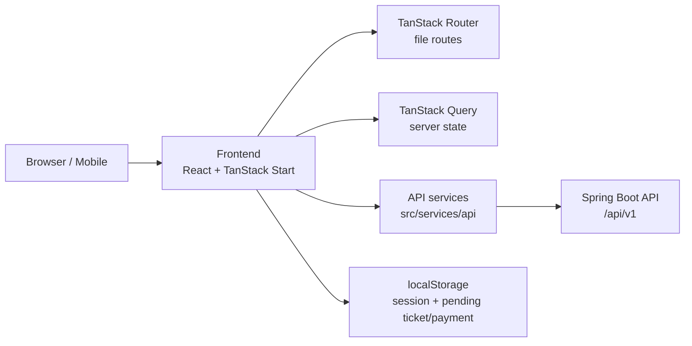
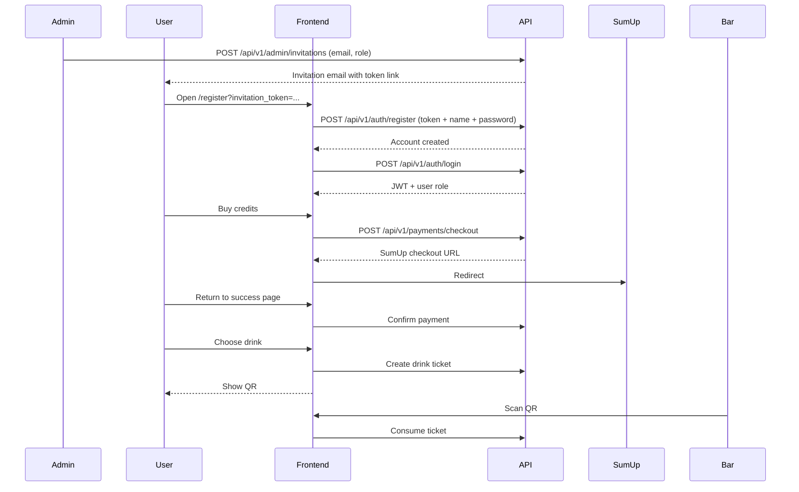
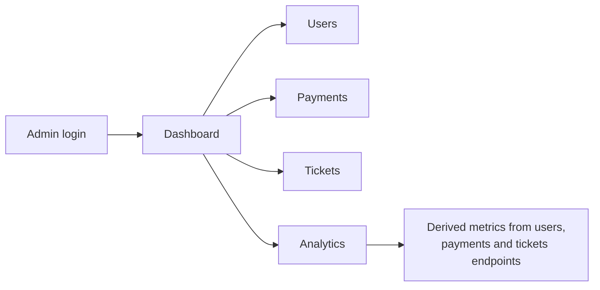

# DrinkCard MOA Frontend


DrinkCard MOA Frontend is the web application for the DrinkCard MOA festival drink-card platform.

The application lets volunteers log in with an admin-issued invitation, buy drink credits, generate one-use QR drink tickets, and review their activity. It also includes a bar scanner for QR validation and an admin area for organizers to monitor users, accounts, payments, tickets, and analytics.

Account creation is **invitation-only**: there is no public sign-up. Admins send an email invitation from the admin dashboard, and the recipient completes their account through the invitation link.

This repository contains the **React, TypeScript, TanStack Start, and Vite frontend**. The backend API is implemented separately with Spring Boot.

## Contents

- [Product Scope](#product-scope)
- [Current Status](#current-status)
- [Architecture](#architecture)
- [Core Flows](#core-flows)
- [Getting Started](#getting-started)
- [Environment Variables](#environment-variables)
- [Docker](#docker)
- [Mobile Testing With Ngrok](#mobile-testing-with-ngrok)
- [Project Structure](#project-structure)
- [Backend Integration](#backend-integration)
- [Troubleshooting](#troubleshooting)
- [Roadmap](#roadmap)

## Product Scope

DrinkCard MOA is designed around three user experiences:

| Experience | Purpose |
| --- | --- |
| Volunteer | Accept invitation, log in, view credits, buy credits, choose a drink, generate QR tickets, and review history. |
| Bar staff | Open the scanner and consume valid QR tickets. |
| Organizer | Review operational data from the admin dashboard, users, tickets, payments, and analytics. |

The frontend intentionally gives the volunteer area a more festival-oriented visual style, while the admin area uses a cleaner and more professional layout for data review.

## Current Status

| Area | Status |
| --- | --- |
| Public landing page | Implemented |
| Invitation-based account creation and login | Implemented |
| Admin invitation flow (email link with token) | Implemented |
| Session persistence | Implemented |
| Volunteer DrinkCard page | Implemented |
| Payment checkout redirect | Implemented |
| Payment confirmation page | Implemented |
| Drink selection and QR ticket generation | Implemented |
| Current QR ticket screen | Implemented |
| Ticket and payment history | Implemented |
| QR scanner page | Implemented |
| Admin dashboard | Implemented |
| Admin users/accounts/tickets/payments pages | Implemented |
| Admin analytics from existing endpoints | Implemented |
| Shift management UI | Placeholder |
| Strict role-specific bar staff experience | Planned |

## Architecture

The frontend is organized around routes, API services, session utilities, and reusable UI components. API calls are isolated under `src/services/api`, while route components focus on page composition and user interaction.



Main frontend responsibilities:

- Keep authentication state in `localStorage`.
- Attach JWT tokens to authenticated API requests.
- Use the Vite `/api` proxy in local development.
- Keep backend access centralized in service modules.
- Separate volunteer, scanner, and admin experiences by route.
- Render admin analytics from the current backend listing endpoints.

## Core Flows

### Volunteer flow

Account creation requires an invitation issued by an admin. The invitation email contains a link with an `invitation_token` that the volunteer uses to complete their account. After that, login is by email and password.



### Admin flow



## Getting Started

### Requirements

- Node.js 24+ or Docker
- npm
- Running DrinkCard MOA backend on port `8080`

### Run locally with npm

```bash
cp .env.example .env
npm install
npm run dev
```

Frontend URL:

```text
http://localhost:5173
```

Build:

```bash
npm run build
```

Lint:

```bash
npm run lint
```

## Environment Variables

The frontend reads Vite variables from `.env`.

```env
# Optional in development. Leave empty to use the Vite /api proxy.
# VITE_API_BASE_URL=http://localhost:8080

# Used by vite.config.ts for local proxy and ngrok host checks.
VITE_API_PROXY_TARGET=http://localhost:8080
VITE_ALLOWED_HOSTS=uncharted-apply-upstart.ngrok-free.dev
```

| Variable | Purpose |
| --- | --- |
| `VITE_API_BASE_URL` | Direct API base URL. If empty in development, requests go through the Vite `/api` proxy. |
| `VITE_API_PROXY_TARGET` | Backend target used by Vite proxy. Default: `http://localhost:8080`. |
| `VITE_ALLOWED_HOSTS` | Comma-separated list of extra hosts accepted by Vite, useful for ngrok. |

Recommended local setup:

```env
VITE_API_BASE_URL=
VITE_API_PROXY_TARGET=http://localhost:8080
```

With this setup, frontend requests such as `/api/v1/auth/login` are proxied by Vite to the Spring Boot backend.

## Docker

This repository includes a development Docker setup for the frontend.

Start the frontend:

```bash
docker compose -f docker-compose.frontend.yml up -d
```

Stop it:

```bash
docker compose -f docker-compose.frontend.yml down
```

View logs:

```bash
docker logs -f drinkcard-front
```

The Docker setup exposes:

```text
http://localhost:5173
```

Inside Docker, the backend proxy target is configured as:

```text
http://host.docker.internal:8080
```

This allows the containerized frontend to reach a backend running on the host machine.

## Mobile Testing With Ngrok

To test the app from a phone:

```bash
ngrok http 5173
```

Then open the generated ngrok URL on the phone.

If Vite blocks the host, add the ngrok host to:

```env
VITE_ALLOWED_HOSTS=your-ngrok-host.ngrok-free.dev
```

When using the Docker compose file, update the same variable in `docker-compose.frontend.yml` if needed, then restart the container.

## Project Structure

```text
src
|-- components
|   |-- admin
|   `-- ui
|-- config
|-- hooks
|-- lib
|-- routes
|   |-- _authenticated
|   |-- index.tsx
|   |-- login.tsx
|   `-- register.tsx
|-- services
|   |-- api
|   |-- payments
|   |-- qr
|   |-- session
|   `-- tickets
|-- router.tsx
|-- server.ts
|-- start.ts
`-- styles.css
```

Important areas:

| Path | Purpose |
| --- | --- |
| `src/routes` | File-based TanStack routes. |
| `src/routes/_authenticated` | Authenticated volunteer, scanner, payment, and admin pages. |
| `src/services/api` | Backend API clients. |
| `src/lib/session.ts` | Session model, persistence, and role helpers. |
| `src/components/AppHeader.tsx` | Authenticated app header. |
| `src/components/admin` | Admin-specific reusable components. |
| `src/services/qr` | QR payload helpers. |
| `src/services/tickets` | Current ticket local persistence. |
| `src/services/payments` | Pending payment local persistence. |

## Backend Integration

The frontend currently uses these backend areas:

| Frontend area | Backend endpoints |
| --- | --- |
| Auth | `POST /api/v1/auth/register` (invitation-only, requires `invitationToken`), `POST /api/v1/auth/login` |
| Current user | `GET /api/v1/users/me` |
| DrinkCard | `GET /api/v1/drink-card-accounts/me` |
| Payments | `POST /api/v1/payments/checkout`, `POST /api/v1/payments/{paymentId}/confirm`, `GET /api/v1/payments/me` |
| Tickets | `POST /api/v1/drink-tickets`, `GET /api/v1/drink-tickets/me`, `GET /api/v1/drink-tickets/{ticketId}/status`, `POST /api/v1/drink-tickets/{ticketId}/consume` |
| Admin | `GET /api/v1/admin/users`, `GET /api/v1/admin/drink-card-accounts`, `GET /api/v1/admin/payments`, `GET /api/v1/admin/drink-tickets` |

All authenticated requests send:

```text
Authorization: Bearer <jwt>
```

## Troubleshooting

### The frontend cannot connect to the backend

Check that the backend is running:

```text
http://localhost:8080
```

If the frontend runs locally, use:

```env
VITE_API_PROXY_TARGET=http://localhost:8080
```

If the frontend runs in Docker, use:

```env
VITE_API_PROXY_TARGET=http://host.docker.internal:8080
```

### Vite blocks an ngrok host

Add the host to `VITE_ALLOWED_HOSTS`.

Example:

```env
VITE_ALLOWED_HOSTS=uncharted-apply-upstart.ngrok-free.dev
```

### Admin panel looks empty

The app stores only one session per browser origin. If you log in as a volunteer in the same browser and origin, it replaces the admin session.

Use one of these options to test multiple roles:

- Admin in a normal browser window and volunteer in an incognito window.
- Admin in one browser and volunteer in another.
- Admin on `localhost:5173` and volunteer on the ngrok URL.

### The app shows an old error after code changes

Vite development cache or browser cache can keep old chunks alive.

Try:

- Close old tabs using `localhost:5173`.
- Hard reload: `Cmd + Shift + R`.
- Clear site data for `localhost:5173`.
- Restart the frontend container:

```bash
docker restart drinkcard-front
```

## Roadmap

Possible next frontend steps:

- Add real shift management once backend endpoints exist.
- Add stricter `BAR_STAFF` route and UI flows.
- Add admin actions to suspend/reactivate users and accounts.
- Add richer filtering and pagination controls to admin tables.
- Add dedicated analytics endpoints when the backend exposes aggregated metrics.
- Improve production deployment configuration.

## License

License information has not been added yet.
